# Rushmore Pizzeria Data Platform

A comprehensive data engineering capstone project that demonstrates the complete lifecycle of building a scalable data platform for a pizzeria chain, from database design to cloud deployment and visualization.

## 📋 Table of Contents

- [Project Overview](#project-overview)
- [Architecture](#architecture)
- [Database Design](#database-design)
- [Entity Relationship Diagram (ERD)](#entity-relationship-diagram-erd)
- [Setup Instructions](#setup-instructions)
- [Deployment Guide](#deployment-guide)
- [Screenshots & Visuals](#screenshots--visuals)
- [Business Analytics](#business-analytics)
- [Data Visualization](#data-visualization)
- [Troubleshooting](#troubleshooting)
- [Technologies Used](#technologies-used)

## 🎯 Project Overview

The Rushmore Pizzeria Data Platform is designed to handle the complete data lifecycle for a multi-location pizzeria chain. The system manages:

- **Store Operations**: Multiple store locations with individual tracking
- **Customer Management**: Customer profiles and order history
- **Menu & Inventory**: Dynamic menu items with ingredient tracking
- **Order Processing**: Complete order lifecycle with detailed line items
- **Analytics**: Business intelligence through Looker Studio dashboards

## 🏗️ Architecture

```
┌─────────────────┐    ┌──────────────────┐    ┌─────────────────┐
│   Python App    │───▶│  PostgreSQL DB   │───▶│  Looker Studio  │
│   (populate.py) │    │  (Google Cloud   │    │   (Analytics)   │
│                 │    │      SQL)        │    │                 │
└─────────────────┘    └──────────────────┘    └─────────────────┘
```

## 🗄️ Database Design

The database follows a **3rd Normal Form (3NF)** design ensuring data integrity and eliminating redundancy:

### Normalization Analysis

**1st Normal Form (1NF)**: ✅
- No repeating groups
- All values are atomic

**2nd Normal Form (2NF)**: ✅
- No partial dependencies
- Junction tables properly handle composite keys

**3rd Normal Form (3NF)**: ✅
- No transitive dependencies
- All non-key attributes depend only on primary keys

## 📊 Entity Relationship Diagram (ERD)

### Core Entities

#### 1. **Stores** 
```sql
stores (
    store_id SERIAL PRIMARY KEY,
    address VARCHAR(255) NOT NULL,
    city VARCHAR(100) NOT NULL,
    phone_number VARCHAR(20) UNIQUE NOT NULL,
    opened_at TIMESTAMP DEFAULT CURRENT_TIMESTAMP
)
```

#### 2. **Customers**
```sql
customers (
    customer_id SERIAL PRIMARY KEY,
    first_name VARCHAR(100) NOT NULL,
    last_name VARCHAR(100) NOT NULL,
    email VARCHAR(255) UNIQUE NOT NULL,
    phone_number VARCHAR(20) UNIQUE NOT NULL,
    created_at TIMESTAMP DEFAULT CURRENT_TIMESTAMP
)
```

#### 3. **Menu Items**
```sql
menu_items (
    item_id SERIAL PRIMARY KEY,
    name VARCHAR(150) NOT NULL,
    category VARCHAR(50) NOT NULL,
    size VARCHAR(20)
)
```

#### 4. **Ingredients**
```sql
ingredients (
    ingredient_id SERIAL PRIMARY KEY,
    name VARCHAR(100) UNIQUE NOT NULL,
    stock_quantity NUMERIC(10,2) NOT NULL DEFAULT 0,
    unit VARCHAR(20) NOT NULL
)
```

#### 5. **Orders**
```sql
orders (
    order_id SERIAL PRIMARY KEY,
    customer_id INTEGER REFERENCES customers(customer_id) ON DELETE SET NULL,
    store_id INTEGER REFERENCES stores(store_id) ON DELETE RESTRICT,
    order_timestamp TIMESTAMP NOT NULL DEFAULT CURRENT_TIMESTAMP,
    total_amount NUMERIC(10,2) NOT NULL
)
```

### Relationship Analysis

#### **Stores ↔ Orders** (One-to-Many)
- **Relationship**: One store can have many orders
- **Foreign Key**: `orders.store_id → stores.store_id`
- **Constraint**: `ON DELETE RESTRICT` (prevents store deletion if orders exist)

#### **Customers ↔ Orders** (One-to-Many)
- **Relationship**: One customer can make many orders
- **Foreign Key**: `orders.customer_id → customers.customer_id`
- **Constraint**: `ON DELETE SET NULL` (preserves order history if customer is deleted)

#### **Menu Items ↔ Ingredients** (Many-to-Many)
- **Relationship**: A menu item uses many ingredients; an ingredient can be in many items
- **Junction Table**: `item_ingredients`
- **Purpose**: Tracks ingredient requirements per menu item

#### **Orders ↔ Menu Items** (Many-to-Many)
- **Relationship**: Each order contains multiple menu items; each item appears in many orders
- **Junction Table**: `order_items`
- **Additional Data**: Quantity and price at time of order

### Junction Tables

#### **Item_Ingredients**
```sql
item_ingredients (
    item_ingredient_id SERIAL PRIMARY KEY,
    item_id INTEGER REFERENCES menu_items(item_id) ON DELETE CASCADE,
    ingredient_id INTEGER REFERENCES ingredients(ingredient_id) ON DELETE CASCADE,
    quantity_required NUMERIC(10,2) NOT NULL
)
```

#### **Order_Items**
```sql
order_items (
    order_item_id SERIAL PRIMARY KEY,
    order_id INTEGER REFERENCES orders(order_id) ON DELETE CASCADE,
    item_id INTEGER REFERENCES menu_items(item_id) ON DELETE RESTRICT,
    quantity INTEGER NOT NULL,
    price_at_time_of_order NUMERIC(10,2) NOT NULL
)
```

## 🔐 Security & RBAC

### Role-Based Access Control Implementation

The system implements comprehensive RBAC with five distinct roles:

#### **Role Hierarchy**

1. **rushmore_admin** - Database Administrator
   - Full database privileges
   - Schema modifications
   - User management

2. **rushmore_manager** - Store Manager
   - Full CRUD operations on all tables
   - Business operations management
   - Staff oversight capabilities

3. **rushmore_staff** - Store Staff
   - Limited operational access
   - Read access to reference data
   - Order processing capabilities

4. **rushmore_analytics** - Business Analyst
   - Read-only access to all tables
   - Reporting and analytics queries
   - No data modification rights

5. **rushmore_app** - Application Service
   - Programmatic database access
   - Automated data processing
   - API integration support

### Security Features

#### **Row Level Security (RLS)**
- Staff users can only access orders from their assigned store
- Managers have unrestricted access to all data
- Context-based data filtering using store location

#### **Audit Logging**
- Complete audit trail for all data modifications
- Tracks user actions with timestamps
- JSON-based change tracking for before/after values
- Automated triggers on sensitive tables

#### **Password Policy**
- Strong password requirements for all users
- Role-based authentication
- Secure service account management

### RBAC Setup

```bash
# Apply RBAC configuration
psql -h <host> -U <admin_user> -d rushmore_db -f rbac.sql
```

### User Context Management

```sql
-- Set user store context for RLS
SELECT set_user_context('London');
```

## 🚀 Setup Instructions

### Prerequisites

- Python 3.8+
- PostgreSQL (local or cloud)
- Google Cloud Platform account (for cloud deployment)

### Local Development Setup

1. **Clone the repository**
```bash
git clone <repository-url>
cd rushmore-pizzeria-data-platform
```

2. **Create virtual environment**
```bash
python -m venv venv
# Windows
venv\Scripts\activate
# macOS/Linux
source venv/bin/activate
```

3. **Install dependencies**
```bash
pip install -r requirements.txt
```

4. **Configure environment**
```bash
cp .env.sample .env
# Edit .env with your database credentials
```

5. **Create database schema**
```bash
psql -h <host> -U <user> -d <database> -f schema.sql
```

6. **Apply RBAC security**
```bash
psql -h <host> -U <user> -d <database> -f rbac.sql
```

7. **Populate with sample data**
```bash
python populate.py
```

## ☁️ Deployment Guide

### Google Cloud SQL Setup

#### Step 1: Create GCP Project
1. Go to [Google Cloud Console](https://console.cloud.google.com)
2. Create new project: `rushmore-capstone-project`
3. Enable **Cloud SQL Admin API**

#### Step 2: Create PostgreSQL Instance
1. Navigate to **SQL** → **Create Instance** → **PostgreSQL**
2. Configure instance:
   - **Version**: PostgreSQL 15
   - **Instance ID**: `rushmore-postgres`
   - **Region**: Choose closest to your location
   - **Machine Type**: `db-f1-micro` (for development)

#### Step 3: Configure Networking
1. **Enable Public IP**
2. **Add Authorized Networks**:
   - Add your local IP address
   - For Looker Studio access, add these IP ranges:
     ```
     142.251.74.0/23
     142.251.76.0/23
     142.251.78.0/23
     142.250.136.0/23
     142.250.152.0/23
     142.250.157.0/24
     ```

#### Step 4: Create Database and User
1. **Create Database**: `rushmore_db`
2. **Create User**: `rushmore_user` with secure password
3. **Grant Permissions**: Full access to `rushmore_db`

#### Step 5: Deploy Schema and Data
1. Update `.env` with Cloud SQL credentials:
```env
DB_HOST=<your-cloud-sql-public-ip>
DB_PORT=5432
DB_NAME=rushmore_db
DB_USER=rushmore_user
DB_PASS=<your-secure-password>
```

2. Run deployment:
```bash
python populate.py
```

Expected data volumes:
- **Stores**: 4 locations
- **Customers**: 1,200+ profiles
- **Menu Items**: 25 items
- **Ingredients**: 45 ingredients
- **Orders**: 6,000+ orders
- **Order Items**: 18,000+ line items

## 📊 Data Population

### populate.py Script Overview

The `populate.py` script generates realistic test data using the Faker library and implements efficient batch processing for database insertion:

#### **Key Features**
- **Environment Configuration**: Reads database credentials from `.env` file
- **Batch Processing**: Configurable batch size (default: 500 records) for optimal performance
- **Progress Tracking**: Visual progress bars using tqdm for long-running operations
- **Data Relationships**: Maintains referential integrity across all tables
- **Realistic Data**: Uses Faker to generate authentic-looking customer profiles, addresses, and timestamps

#### **Data Generation Process**
1. **Stores**: Creates 4 pizzeria locations with unique addresses and phone numbers
2. **Ingredients**: Generates 45 ingredients with stock quantities and units (kg, g, liters, units)
3. **Menu Items**: Creates 25 menu items across categories (Pizza, Drink, Side) with appropriate sizes
4. **Item-Ingredient Mapping**: Each menu item uses 3-8 random ingredients with required quantities
5. **Customers**: Generates 1,200 customer profiles with unique emails and contact information
6. **Orders & Order Items**: Creates 6,000 orders with 3 items per order on average, calculating totals automatically

#### **Performance Optimizations**
- **Bulk Inserts**: Uses `execute_values()` for efficient batch processing
- **Memory Management**: Processes data in configurable chunks to prevent memory overflow
- **Transaction Management**: Commits data in batches to ensure consistency
- **Seed Values**: Uses fixed seeds (42) for reproducible test data generation

## 📸 Screenshots & Visuals

### Database Schema Visualization
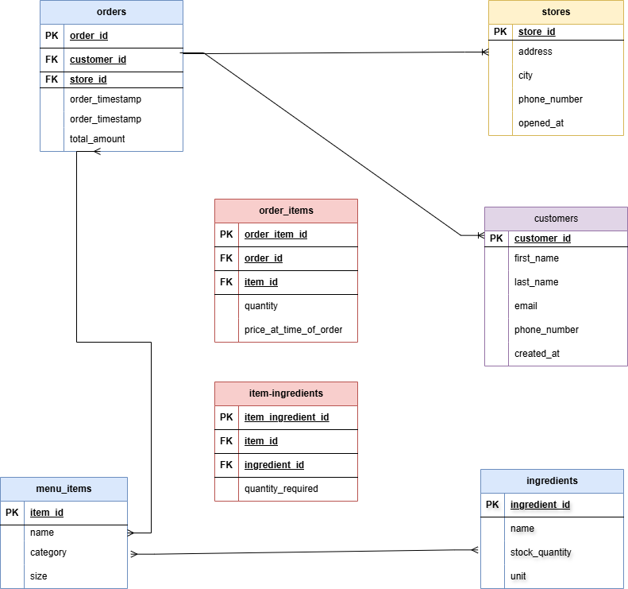
*Entity Relationship Diagram showing all tables and their relationships*

### Database Tables Created
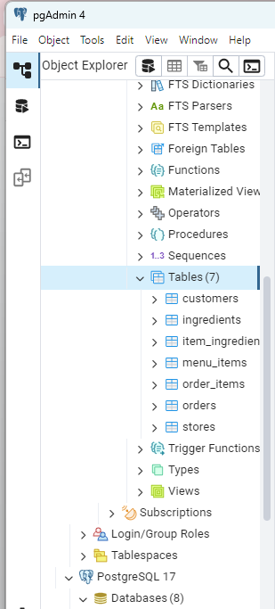
*Successfully created database tables in PostgreSQL following the schema design*

### Data Population Process
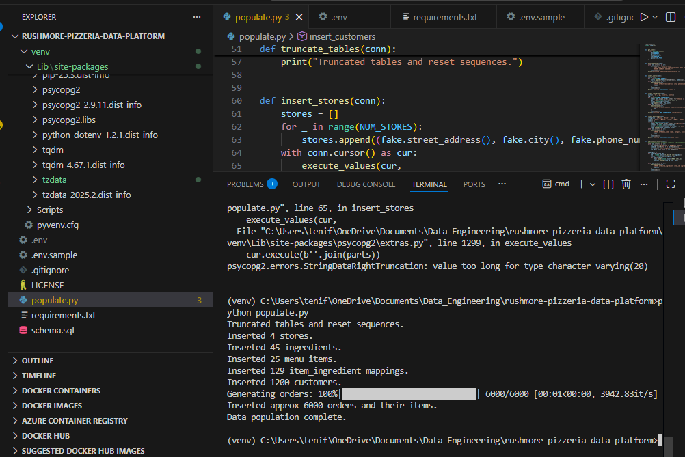
*Python populate.py script successfully inserting sample data into the database*

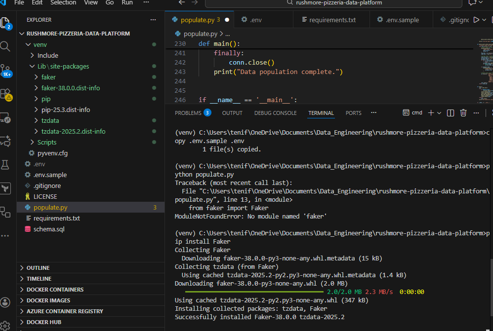
*Additional data population process screenshot*

### Database Query Results

#### Stores Table
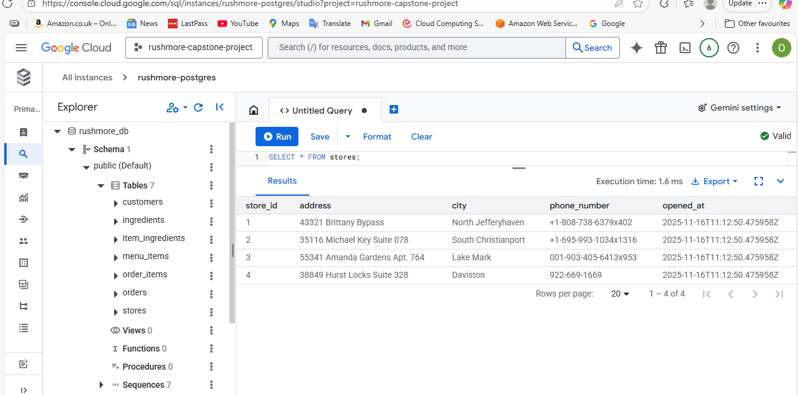
*Sample data from the stores table showing pizzeria locations*

#### Customers Table
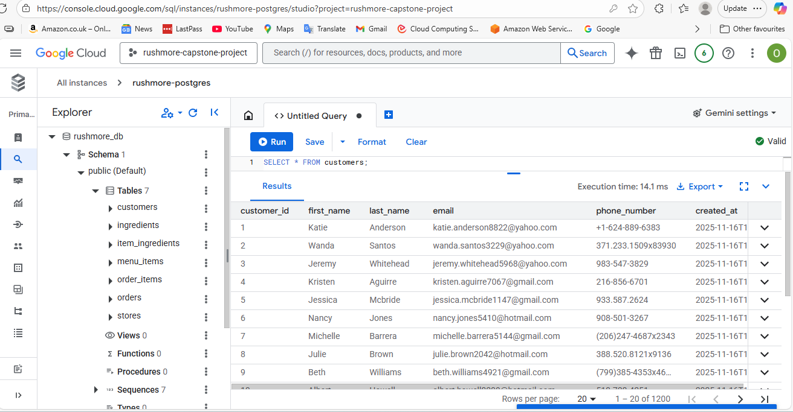
*Customer data with profiles and contact information*

#### Menu Items Table
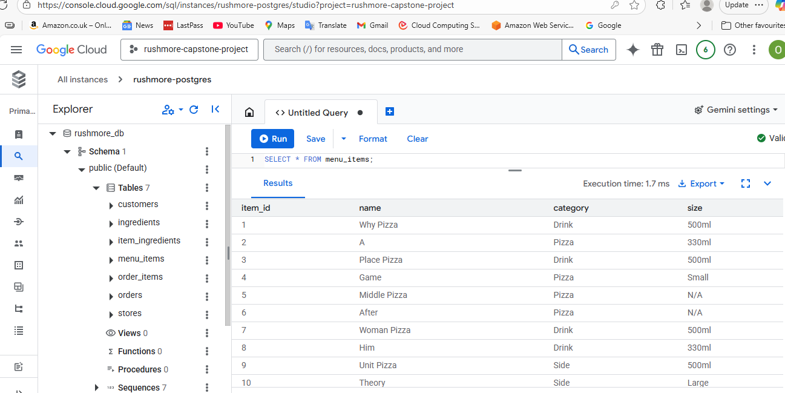
*Pizza menu items with categories and sizes*

#### Ingredients Table
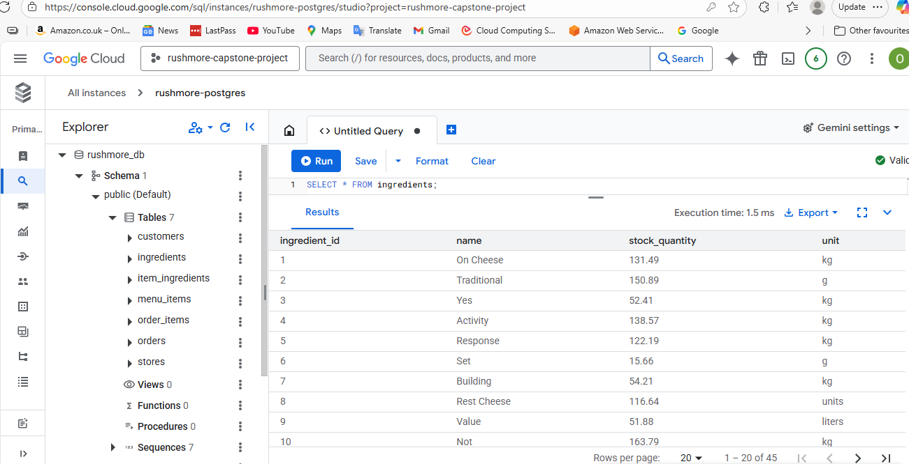
*Ingredient inventory with stock quantities and units*

#### Orders Table
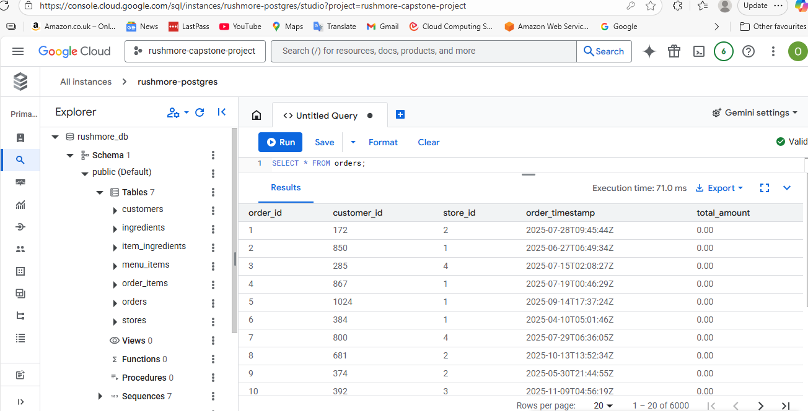
*Order records with timestamps and total amounts*

#### Item Ingredients Junction Table
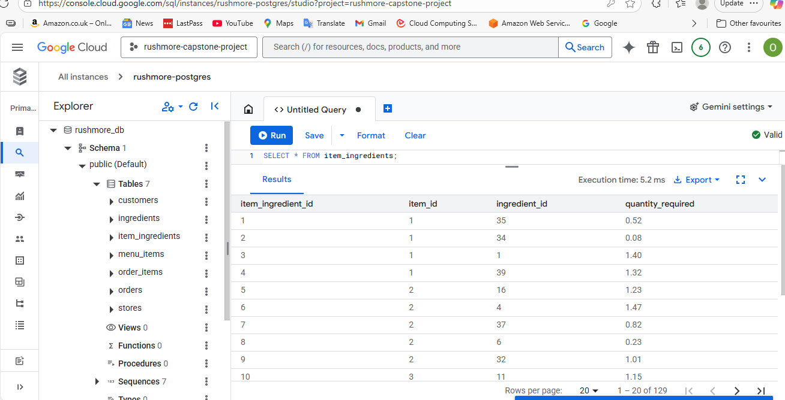
*Many-to-many relationship between menu items and ingredients*

### Looker Studio Setup & Integration
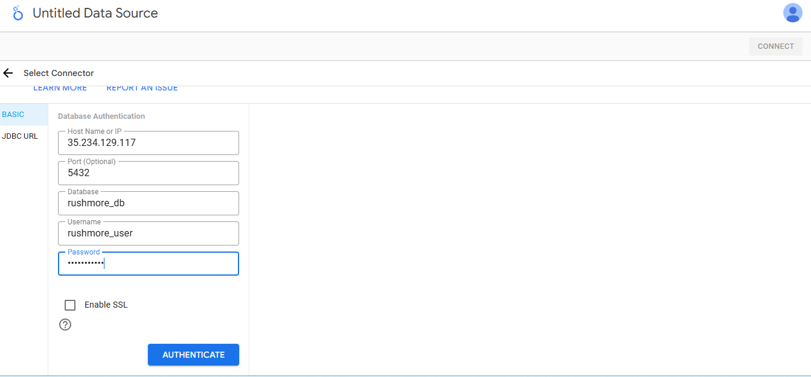
*Looker Studio connection configuration with Google Cloud SQL PostgreSQL*

### Business Intelligence Dashboard
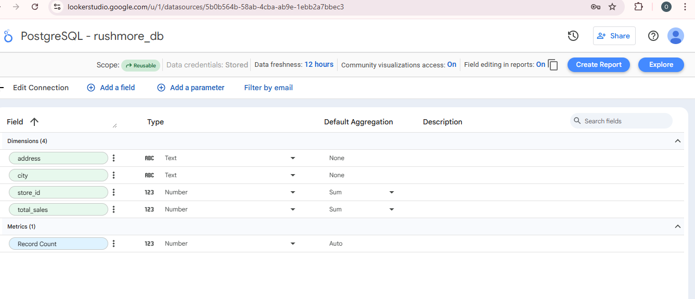
*Interactive dashboard displaying key business metrics and analytics*

## 📊 Business Analytics

### Key Analytics Queries

The `analytics.sql` file contains essential business intelligence queries for operational insights:

#### 1. **Store Performance Analysis**
```sql
-- Total sales revenue per store
SELECT
  s.store_id,
  s.address,
  s.city,
  COALESCE(SUM(o.total_amount), 0) AS total_sales
FROM stores s
LEFT JOIN orders o ON s.store_id = o.store_id
GROUP BY s.store_id, s.address, s.city
ORDER BY total_sales DESC;
```

#### 2. **Customer Lifetime Value**
```sql
-- Top 10 most valuable customers (by total spending)
SELECT
  c.customer_id,
  c.first_name || ' ' || c.last_name AS customer_name,
  c.email,
  COALESCE(SUM(o.total_amount), 0) AS total_spent,
  COUNT(o.order_id) AS num_orders
FROM customers c
LEFT JOIN orders o ON c.customer_id = o.customer_id
GROUP BY c.customer_id, customer_name, c.email
ORDER BY total_spent DESC
LIMIT 10;
```

#### 3. **Product Performance**
```sql
-- Most popular menu item by quantity sold
SELECT
  mi.item_id,
  mi.name,
  mi.category,
  SUM(oi.quantity) AS total_qty_sold
FROM menu_items mi
JOIN order_items oi ON mi.item_id = oi.item_id
GROUP BY mi.item_id, mi.name, mi.category
ORDER BY total_qty_sold DESC
LIMIT 1;
```

#### 4. **Average Order Value**
```sql
-- Average order value
SELECT
  ROUND(AVG(total_amount)::numeric, 2) AS avg_order_value,
  COUNT(order_id) AS total_orders
FROM orders;
```

#### 5. **Operational Insights**
```sql
-- Busiest hours of the day for orders
SELECT
  EXTRACT(HOUR FROM order_timestamp) AS hour_of_day,
  COUNT(*) AS orders_count
FROM orders
GROUP BY hour_of_day
ORDER BY orders_count DESC;
```

### Analytics Procedure

To run the business analytics queries:

Or run individual queries by copying from the file

3. **Query Results Summary**:
   - **Store Performance**: Ranks stores by total revenue to identify top performers
   - **Customer Analysis**: Lists top 10 customers by spending with order frequency
   - **Product Insights**: Identifies the single most popular menu item by quantity
   - **Financial Metrics**: Calculates average order value across all transactions
   - **Operational Data**: Shows peak ordering hours for staffing optimization

### Business Value
- **Revenue Optimization**: Identify top-performing stores and products
- **Customer Segmentation**: Target high-value customers for retention
- **Operational Efficiency**: Optimize staffing based on peak hours
- **Menu Engineering**: Focus on popular items and discontinue underperformers

## 📈 Data Visualization

### Looker Studio Integration

#### Connection Setup
1. Open [Looker Studio](https://datastudio.google.com)
2. **Create** → **Data Source** → **PostgreSQL**
3. Configure connection:
   - **Hostname**: Cloud SQL Public IP
   - **Port**: 5432
   - **Database**: rushmore_db
   - **Username/Password**: rushmore_user credentials

#### Key Metrics Dashboard
- **Sales Performance**: Revenue trends by store and time period
- **Customer Analytics**: Order frequency and customer lifetime value
- **Inventory Management**: Ingredient usage and stock levels
- **Operational Insights**: Peak hours and popular menu items

## 🔧 Troubleshooting

### Common Issues and Solutions

#### Issue 1: Phone Number Length Error
**Error**: `psycopg2.errors.StringDataRightTruncation: value too long for type character varying(20)`

**Root Cause**: Faker generates phone numbers longer than 20 characters

**Solution**: Truncate phone numbers in populate.py:
```python
# Before (causing error)
fake.phone_number()

# After (fixed)
fake.phone_number()[:20]
```

#### Issue 2: execute_values RETURNING Error
**Error**: `psycopg2.extras.py line 1299, in execute_values`

**Root Cause**: Using `RETURNING` clause without `fetch=True` parameter

**Solution**: Remove unnecessary RETURNING clause:
```python
# Before (causing error)
execute_values(cur, "INSERT INTO stores (...) VALUES %s RETURNING store_id", stores)

# After (fixed)
execute_values(cur, "INSERT INTO stores (...) VALUES %s", stores)
```

#### Issue 3: Looker Studio Connection Error
**Error**: `Error 3180d503` - Authentication failed

**Root Cause**: Looker Studio IP addresses not in authorized networks

**Solution**: Add Looker Studio IP ranges to Cloud SQL authorized networks (see deployment guide)

#### Issue 4: Cloud SQL Admin API Error
**Error**: `Error ID: 9f01dae7` - Unable to complete request

**Root Cause**: Cloud SQL Admin API not enabled

**Solution**: 
1. Go to **APIs & Services** → **Library**
2. Search and enable **Cloud SQL Admin API**

### Performance Optimization

#### Database Indexes
The schema includes optimized indexes for common queries:
```sql
CREATE INDEX idx_orders_store_ts ON orders (store_id, order_timestamp);
CREATE INDEX idx_orders_customer ON orders (customer_id);
CREATE INDEX idx_order_items_item_id ON order_items (item_id);
```

#### Data Population Script
The populate.py script implements efficient data generation:
- **Faker Integration**: Realistic test data generation
- **Batch Processing**: 500 records per transaction for optimal performance
- **Progress Tracking**: tqdm progress bars for user feedback
- **Relationship Management**: Maintains foreign key integrity across tables
- **Environment Configuration**: Flexible database connection via .env file

## 🛠️ Technologies Used

### Backend
- **Python 3.8+**: Core application language
- **PostgreSQL**: Relational database management
- **psycopg2**: PostgreSQL adapter for Python
- **Faker**: Realistic test data generation
- **python-dotenv**: Environment variable management
- **tqdm**: Progress bar visualization

### Cloud Infrastructure
- **Google Cloud SQL**: Managed PostgreSQL service
- **Google Cloud Console**: Infrastructure management
- **Looker Studio**: Business intelligence and visualization

### Development Tools
- **Git**: Version control
- **Virtual Environment**: Dependency isolation
- **pgAdmin**: Database administration (optional)

## 📝 Project Structure

```
rushmore-pizzeria-data-platform/
├── schema.sql              # Database schema definition
├── rbac.sql               # Role-based access control configuration
├── populate.py             # Data generation and insertion script
├── analytics.sql           # Business intelligence queries
├── requirements.txt        # Python dependencies
├── .env.sample            # Environment variables template
├── .gitignore             # Git ignore rules
├── README.md              # Project documentation
└── screenshot/            # Project screenshots and diagrams
```

## 🎓 Learning Outcomes

This capstone project demonstrates proficiency in:

1. **Database Design**: Normalized schema design following 3NF principles
2. **Security Implementation**: Role-based access control and audit logging
3. **Data Engineering**: ETL processes and batch data processing
4. **Cloud Deployment**: Google Cloud Platform services integration
5. **Data Visualization**: Business intelligence dashboard creation
6. **Problem Solving**: Debugging and troubleshooting production issues
7. **Documentation**: Comprehensive project documentation and knowledge sharing

## 📄 License

This project is licensed under the MIT License - see the [LICENSE](LICENSE) file for details.

---